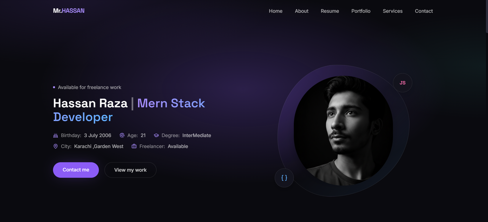

# Mr hassan raza — Full Stack Developer Portfolio


React + Tailwind CSS + Framer Motion + GSAP recreation of the portfolio design.

## Stack

- **React 18** + **Vite** — app shell & fast dev server
- **Tailwind CSS** — utility styling, custom color/type tokens in `tailwind.config.js`
- **Framer Motion** — page-load reveals, staggered lists, scroll-triggered fades, mobile menu transitions, scroll-progress bar
- **GSAP** (+ ScrollTrigger) — floating hero blob/badges, animated skill bars, scroll-drawn resume timeline
- **lucide-react** — icon set

## Getting started

```bash
npm install
npm run dev
```

Then open the printed local URL (usually `http://localhost:5173`).

Build for production:

```bash
npm run build
npm run preview
```

## Project structure

```
src/
  data.js              content for nav, hero, skills, resume, portfolio, services, socials
  index.css            Tailwind layers + base styles, custom scrollbar, glass-card utility
  App.jsx              composes sections + scroll progress bar
  components/
    Navbar.jsx          sticky nav, mobile drawer (Framer Motion)
    Hero.jsx             intro, floating decorative blob/badges (GSAP)
    Skills.jsx            backend/frontend skill bars, fill animation on scroll (GSAP + ScrollTrigger)
    Resume.jsx             timeline, scroll-scrubbed connector line (GSAP + ScrollTrigger)
    Portfolio.jsx            filterable project carousel (Framer Motion layout animation)
    Services.jsx             4-up service cards
    Contact.jsx               social links + footer
```

## Customizing

- Swap the hero placeholder shape in `Hero.jsx` for a real photo by dropping an image into `src/assets` and rendering it inside the blob wrapper.
- Update copy, skills, timeline steps, and portfolio items in `src/data.js` — components are all data-driven.
- Color tokens (`ink`, `violet`, `accent.*`) live in `tailwind.config.js`.
- Reduced-motion users automatically get animations shortened via the `prefers-reduced-motion` rule in `index.css`.

## Note

This sandbox has no network/npm-registry access, so dependencies could not be installed or the dev server test-run here — install locally with the command above to run it.
